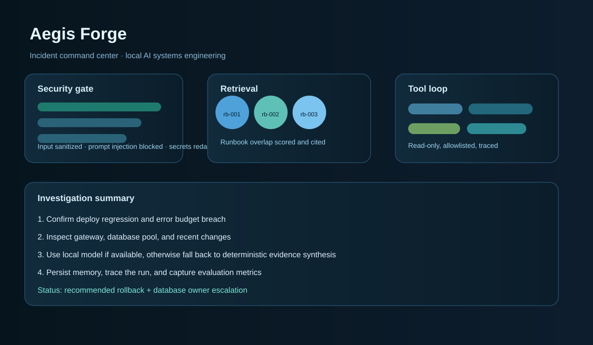

# Aegis Forge

**A production-shaped, local-first AI incident operations platform.**

[](https://github.com/gbemidaniel100-bot/Certora-prover/actions/workflows/ci.yml)
[](https://www.python.org/)
[](LICENSE)

Aegis Forge is an auditable incident command workbench, not a chat wrapper. Give it an operational signal and it coordinates a guarded investigation: it retrieves runbook evidence, plans bounded read-only tool calls, uses an Ollama model when available, falls back to a deterministic offline analyst, persists useful memory, and returns a trace showing what happened. It ships as a Python package, container, Compose stack, CLI, API, dashboard, evaluation harness, and CI-tested repository.



## Why this is interesting

- **Agent orchestration:** a stateful investigation loop with explicit policy, retrieval, planning, tools, synthesis, memory, and evaluation stages.
- **Model orchestration:** Ollama is the local reasoning provider, with a tested offline path so the demo never depends on a cloud API or a running model.
- **RAG:** a tiny inspectable runbook corpus with token-scored retrieval and source IDs in every result. The retriever is intentionally replaceable with embeddings later.
- **Tool use:** an allowlisted registry of deterministic adapters. Every adapter is read-only, risk-labelled, bounded by `AEGIS_MAX_TOOL_CALLS`, and recorded.
- **Memory:** SQLite stores namespace-scoped incident learnings with importance ordering.
- **Observability:** every run emits append-only events for security, retrieval, tool calls, and completion; traces are available from the API.
- **Evaluation:** three repeatable incident cases measure keyword task quality and grounding, with scores stored in SQLite.
- **Security:** input length limits, namespace validation, prompt-injection checks, secret/number redaction, no arbitrary tool execution, and a human-approval boundary for destructive actions.
- **Service engineering:** app factory, readiness probe, Prometheus-compatible metrics, request validation, SQLite WAL mode, busy timeout, and concurrency-safe persistence.
- **Evidence-to-decision graph:** ranked hypotheses, source citations, blast-radius framing, reversible actions, counterfactual checks, and explicit human-approval policy. This is the core product differentiator: Aegis turns evidence into an inspectable decision artifact, not an opaque answer.
- **Model routing:** priority-ordered Ollama candidates with retries, timeout budgets, circuit breakers, and provider-attempt telemetry.
- **Human-in-the-loop:** propose, approve, and execute endpoints. The default runtime never executes a mutation without an approval trace.
- **Live operations:** server-sent event streams expose security, retrieval, tool, model, decision, and approval stages to the dashboard.
- **Evaluation science:** a 60-task benchmark reports retrieval accuracy, evidence-bound hallucination rate, success rate, per-category quality, and p50/p95 latency.
- **OpenTelemetry:** every HTTP request gets a service span and trace ID response header, ready for OTLP exporters without changing the application workflow.

## Quick start

```bash
python -m venv .venv
source .venv/bin/activate
pip install -e ".[dev]"
uvicorn aegis_forge.api:app --reload
```

Open `http://127.0.0.1:8000`. The dashboard works immediately in offline mode. For local model reasoning, install [Ollama](https://ollama.com), then run:

```bash
ollama pull llama3.2:3b
```

### Container quick start

```bash
docker compose up --build
```

The Compose profile starts Aegis Forge and Ollama with persistent volumes. Aegis remains useful when Ollama is unavailable because the deterministic offline analyst is a deliberate resilience path.

Configuration is environment-based:

```bash
cp .env.example .env
export AEGIS_MODEL=llama3.2:3b
export AEGIS_MODEL_FALLBACK=llama3.2:1b
```

The application does not load `.env` automatically; exporting variables keeps deployment behavior explicit.

Cloud VM deployment is documented in [docs/cloud-vm.md](docs/cloud-vm.md), with the routing decision recorded in [docs/adr-001-local-first-model-routing.md](docs/adr-001-local-first-model-routing.md).

## CLI and API

```bash
aegis "Payments API has elevated 5xx responses after the latest deploy"
aegis --eval
curl http://127.0.0.1:8000/health
curl -X POST http://127.0.0.1:8000/api/investigate \
	-H 'content-type: application/json' \
	-d '{"incident":"Database connections are exhausted and retries are increasing","namespace":"demo"}'
```

Important endpoints are `POST /api/investigate`, `GET /api/runs/{run_id}/trace`, `GET /api/runs/{run_id}/events`, `GET /api/runs/{run_id}/decision`, `POST /api/evaluate`, `POST /api/benchmark`, `POST /api/approvals/propose`, `POST /api/approvals/approve`, `POST /api/approvals/execute`, `GET /ready`, `GET /metrics`, and `GET /metrics/json`. Open `/docs` for the generated OpenAPI contract.

## Architecture

```text
request
	-> security gate + redaction
	-> runbook retriever + namespace memory
	-> bounded tool planner
	-> read-only adapters
	-> Ollama / offline synthesizer
	-> durable memory + append-only trace
	-> typed API response + operator dashboard
```

The code is deliberately modular enough to inspect and serious enough to run. `IncidentAgent` owns the workflow; `Retriever`, `ToolRegistry`, `LocalModel`, `DecisionEngine`, `Store`, `ServiceContainer`, and `Metrics` are replaceable boundaries. Read [docs/architecture.md](docs/architecture.md) and [docs/decision-engine.md](docs/decision-engine.md) for the system map and decision contract.

## Verification

```bash
make test
make lint
python -m compileall -q src
```

The tests verify injection blocking before tool execution, strict namespace validation, evidence retrieval, bounded tool fan-out, memory and trace persistence, API contracts, Prometheus metrics, relevance ranking, and redaction. CI runs the suite across Python 3.11, 3.12, and 3.13. The local model path is intentionally optional, while the Ollama adapter degrades cleanly when the daemon is absent.

For a deeper verification pass:

```bash
python -m pytest -q
python -m ruff check .
python -m compileall -q src
docker build -t aegis-forge:verify .
```

The stress suite exercises 200 concurrent investigations against one SQLite store and verifies unique traces, durable memories, low-confidence unknowns, and the no-mutation safety invariant.

## Deliberate production boundaries

The repository intentionally keeps dangerous capabilities outside the default runtime. Before connecting it to production telemetry, add OIDC identity, tenant authorization, a managed database, document ACL filtering, rate limits, a secrets manager, OpenTelemetry spans, and a separate approval service for mutating actions. See [SECURITY.md](SECURITY.md) for the threat-model boundary.

## License

MIT
