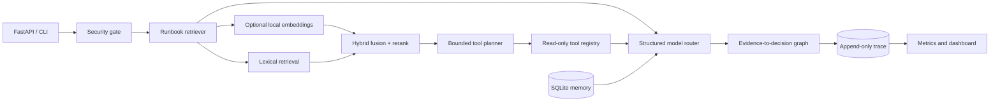

# Architecture

Aegis Forge is organized around explicit boundaries rather than a single prompt function.

## Runtime guarantees

- Inputs are normalized, bounded, namespace-validated, and inspected for injection signals.
- Tools are selected from a fixed allowlist and return deterministic simulated evidence.
- The model is advisory; destructive actions are not exposed by the runtime.
- Ollama failure degrades to a deterministic offline response.
- SQLite uses WAL mode and a busy timeout for concurrent local API requests.
- Every request and investigation produces observable counters and a run trace.
- Every investigation produces a decision artifact with citations, alternatives, counterfactuals, reversible actions, and an explicit approval boundary.
